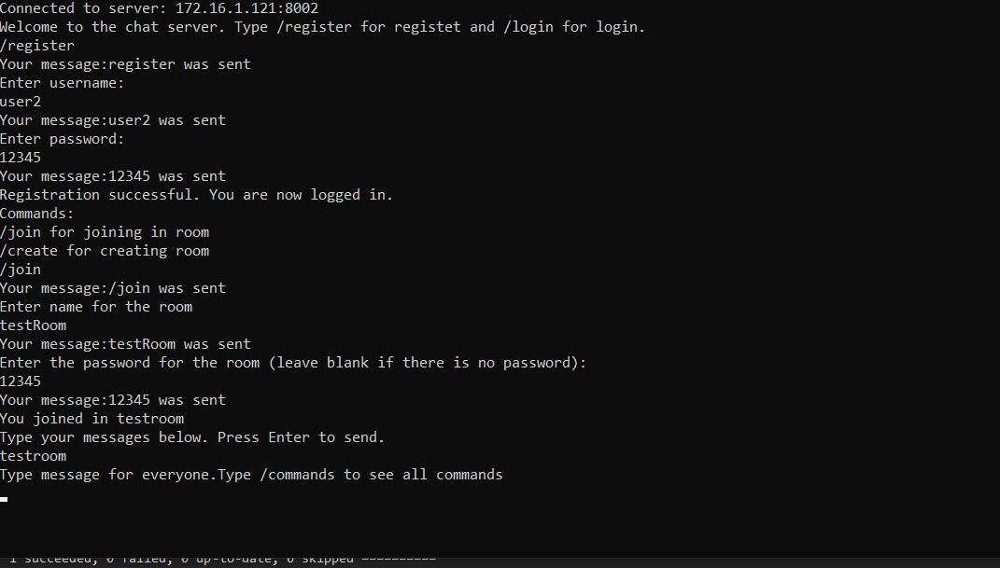

# RpgGame

How to Install and Run the Project?  ⚙️

<ol>
<li>git clone https://github.com/EmilStanchev/RpgGame.git</li>
<li>Open the server side folder with Visual Studio </li>
<li>Go to folder Models then ServerModels then Server</li>
<li>You should change the IP address and the port with yours</li>
<li>You almost ready. You just need to start the project: CTRL+F5</li>
<li>You started your server side</li>
<li>Open the ClientSide folder wit Visual Studio </li>
<li>Change IP address and port</li>
<li>Press CTRL+F5</li>
<li>Make a registration and have fun</li>
<li>If you're still having trouble take a look to Screenshots</li>
</ol>

 

App Description 🎮

ChatNet is a local chat console application developed in C# that enables real-time communication among users within a Local Area Network (LAN). With its user-friendly interface and robust features, ChatNet provides a seamless platform for efficient messaging and collaboration in a LAN environment.

Key Features :

<ol>
<li><b>Real-time messaging:</b> Send and receive messages instantly within the LAN, ensuring quick and efficient communication.    </li>
<li><b>User-friendly interface:</b> Enjoy an intuitive and easy-to-use chat interface that facilitates effortless navigation and interaction</li>
<li><b>LAN connectivity:</b> Connect and communicate with other users on the same Local Area Network, fostering collaboration and interaction.</li>
<li></li><b>Flexible and extensible:</b> ChatNet is designed to be easily extensible, allowing for the addition of new features and functionality to meet specific requirements.</li>
</ol>

 
The app is for educational purposes!

 

# Technologies Used 🔑

 
# Developers 👨🏻‍💻
## Architecture 🔧
 

Project Overview 🧐

ChatNet is a local chat application built in C# that allows users to communicate with each other within a Local Area Network (LAN). It provides a seamless and intuitive platform for real-time messaging and collaboration, making it an ideal solution for users who want to connect and exchange information within their LAN environment.. The project is organized into several folders, each with a specific purpose. I believe that educational apps can be both fun and beneficial, so I designed this app to help reinforce key concepts in a fun and engaging way. Whether you're a student or just looking to learn something new, this app is designed to challenge your skills and expand your knowledge.

 

ServeSide folder 📂

This folder contains the server-side code for the ChatNet application. It includes the implementation of the chat server, which manages client connections and facilitates message transmission within the Local Area Network (LAN).

 

 

Services folder 📂

The Logic folder contains all of the services and the main logic for the app. This includes the app mechanics, such as combat and character progression. The services are responsible for managing various aspects of the app, such as handling inputs and outputs, managing the app state, and handling interactions between different app objects.

 

Interface folder 📂

The Interface folder contains all of the interfaces that are used throughout the app. These interfaces define the various components of the app, such as the player, enemies, items, and abilities. This allows for greater flexibility and easier maintenance of the code.

 

Models folder 📂

The Models folder contains all of the classes that describe the various app objects, such as the heroes and items. These classes are used by the app logic to manage the app state and handle interactions between objects. Additionally, there are several helper classes included in the project. These classes are responsible for reading input from the console and writing output to the console, making it easier to interact with the app.

 

ChatConnect folder 📂

The 'ChatConnect' folder contains the main entry point for the application, including the 'Program.cs' file and the Ninject configuration. Ninject is used to manage dependency injection throughout the application, making it easier to maintain and modify the code.

 

Benefits 🔥

Overall, this project provides a solid foundation for building a robust and engaging console role-playing game in C#. The well-organized structure, use of interfaces, and dependency injection with Ninject and Ninject Factory make it easy to extend and modify the app logic as needed.

 

## Your ideas 💡

Collaborating for a Better Chat Net: Your Ideas Welcome 📢

I believe that software developers are some of the most creative and innovative people out there. That's why I welcome your ideas on how we can expand and improve our ChatNet application. Whether it's a new feature you'd like to see, a way to enhance user experience, or a suggestion to optimize performance, I am always eager to hear from our community. I encourage you to reach out to us and share your thoughts on how we can make ChatNet even better. I am here to collaborate with you and build a robust, intuitive, and enjoyable chat application for all. Together, let's shape the future of ChatNet and create an exceptional communication experience.

 

# Screenshots 📸

Start

<h3>Server side:</h3>
<h3>Client side:</h3>
<h3>Connect:</h3> 

Rooms

<h3>Creating room</h3>

<h3>Joining in room</h3>

Commands

Chatting

